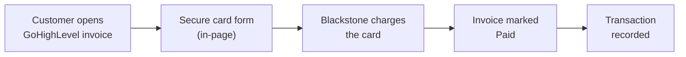
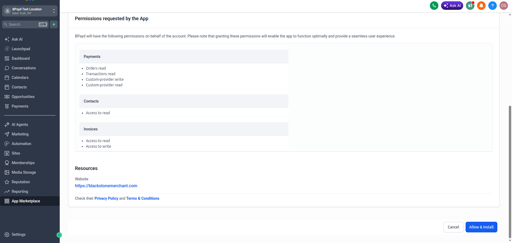
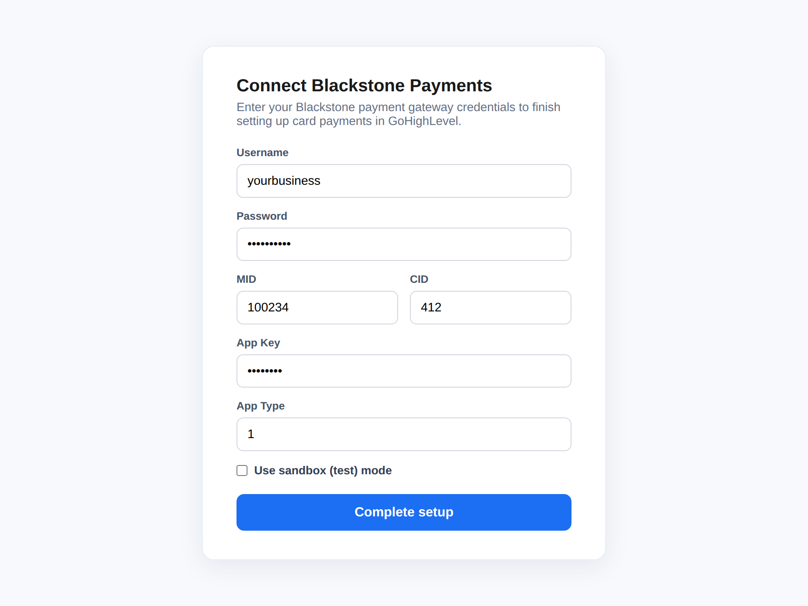
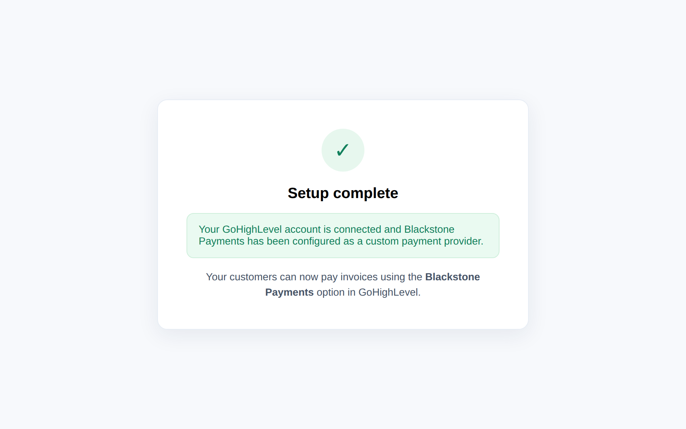
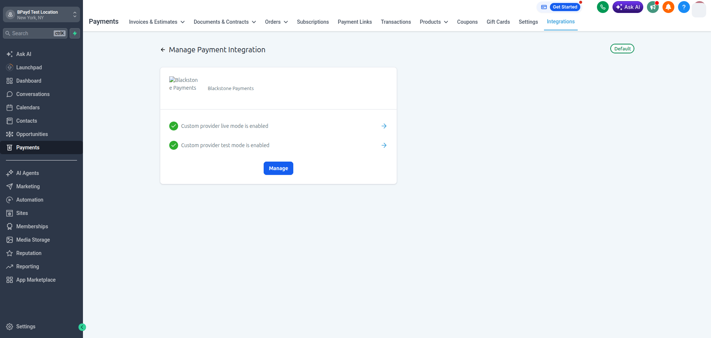
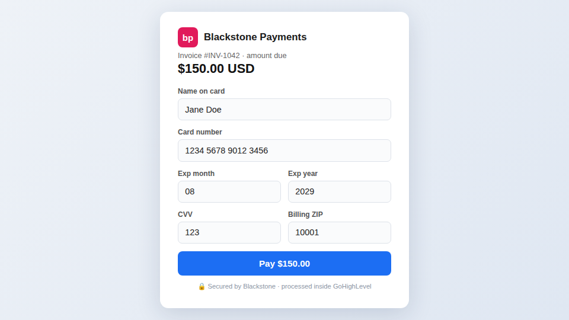
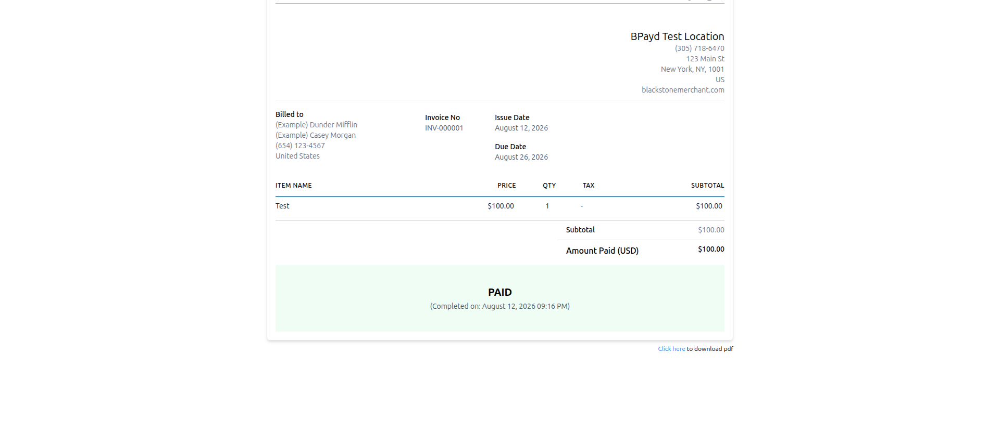
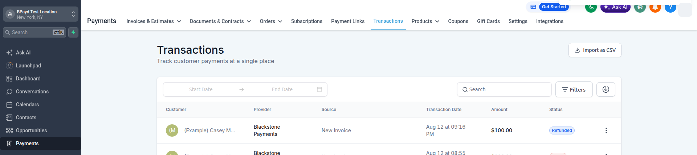
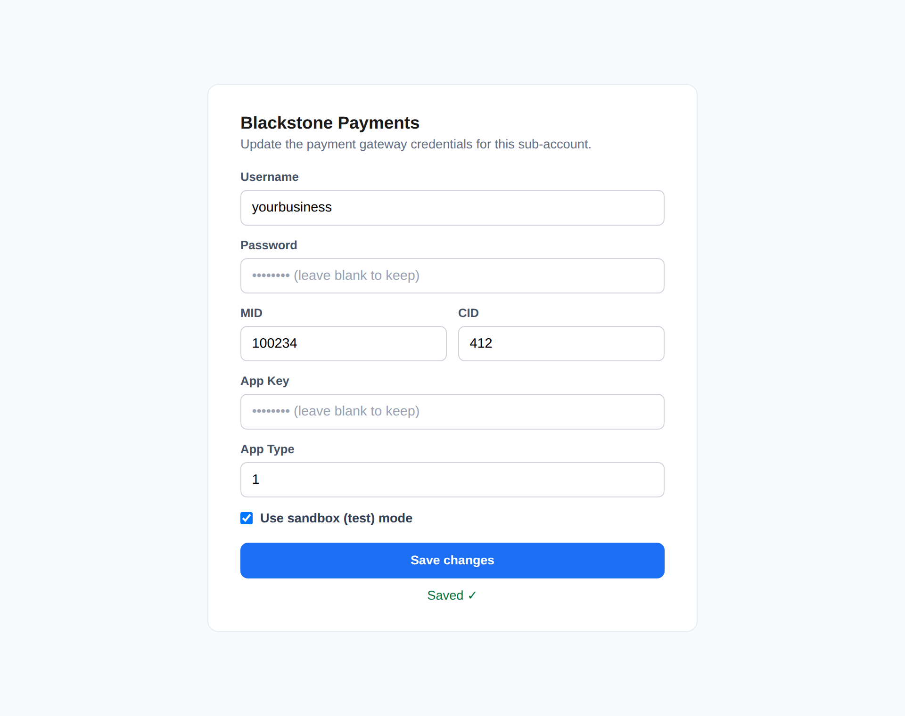

# GoHighLevel Integration

Accept credit card payments on your **GoHighLevel** invoices through Blackstone. Once the BPayd app is installed on your sub-account, customers can pay an invoice by card right inside GoHighLevel and the invoice is marked **Paid** automatically - no manual reconciliation. Full and partial refunds are handled from the same place.

!!! info "How card data is handled"
    Card details are processed by Blackstone and never stored by the integration. Blackstone carries the PCI-DSS compliance for card data.

## How it works

1. You send the invoice from GoHighLevel and your customer opens it.
2. They choose **Blackstone Payments** and enter their card on a secure in-page form.
3. Blackstone charges the card and returns an authorization.
4. The invoice is marked **Paid** and the transaction is recorded automatically.

## Before you begin

| Requirement | Detail |
|-------------|--------|
| GoHighLevel | A sub-account where you send invoices |
| Blackstone credentials | Username, Password, Merchant ID (MID), Cashier ID (CID), App Key, App Type |
| Install link | Provided by Blackstone for the BPayd app |

!!! tip "Don't have your Blackstone credentials?"
    Contact Blackstone Merchant Services at <mailto:support@blackstonemerchant.com> or **305-718-6470** to get your merchant credentials and a sandbox (test) account.

## Install the app

Open the BPayd install link inside GoHighLevel, choose the **sub-account** where you want card payments, and confirm the install. GoHighLevel shows exactly what the app can access - payments, contacts, and invoices only.

## Connect Blackstone Payments

Right after installing you land on a short form. Enter your Blackstone credentials and click **Complete setup**. Tick **Use sandbox (test) mode** while testing.

!!! note "Your credentials are protected"
    Blackstone passwords and app keys are encrypted at rest with AES-256-GCM. They are never stored in plain text.

## Confirm the payment provider

In your sub-account, go to **Payments → Integrations**. **Blackstone Payments** appears as a connected provider, with live and test modes enabled.

## Take a payment

### 1. Create and send an invoice

In **Payments → Invoices**, create an invoice: pick the customer, add products, then send it or copy the payment link to share.

### 2. Pay

When the customer opens the invoice and chooses **Blackstone Payments**, a secure card form appears in-page. They enter the card details including the billing ZIP and pay.

!!! tip "Sandbox test card"
    In test mode, use card `4111 1111 1111 1111`, expiry `08/30`, CVV `123`, ZIP `32606`. No real money moves in sandbox.

## Confirm it's paid

As soon as the payment is approved, the invoice is marked **Paid** automatically - nothing to reconcile by hand.

## Refunds

Full and partial refunds are supported. Go to **Payments → Transactions**, open the transaction and issue the refund - it is processed through Blackstone and the status updates to **Refunded**.

## Update your credentials

Need to change your Blackstone details or switch between sandbox and live? Open **Blackstone Payments** from your sub-account's left menu at any time, update the fields, and click **Save changes**. Leave a secret field blank to keep the stored value.

## Going live

!!! warning "Real money moves in production"
    Open the settings page, untick **Use sandbox (test) mode**, and enter your **production** Blackstone credentials. Do a small real payment to confirm everything works before sending invoices widely.

## Troubleshooting

| Issue | Fix |
|-------|-----|
| Card form stuck on "Loading…" | Refresh the invoice page. If it persists, confirm the app is installed and the provider shows connected in **Payments → Integrations**. |
| Payment declined | Declines come from the card issuer or your Blackstone account. Check the card details and your MID / credentials on the settings page. |
| Settings page shows "not connected" | The sub-account isn't linked yet - reinstall the app to connect it. |
