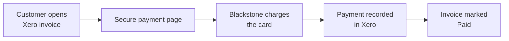

# Xero Integration

Accept credit card payments on your **Xero** invoices through Blackstone. Once your Xero organisation is connected, customers can pay an invoice online and the payment is recorded back in Xero automatically - the invoice is marked **Paid** with no manual reconciliation.

!!! info "How card data is handled"
    Card details are processed by Blackstone and never pass through Xero, and are never stored by the integration. Blackstone carries the PCI-DSS compliance for card data.

## How it works

1. The customer opens their invoice and follows the payment link.
2. They enter their card on a secure payment page.
3. Blackstone charges the card and returns an authorization.
4. The payment is recorded against the invoice in Xero, which is marked **Paid**.

## Before you begin

| Requirement | Detail |
|-------------|--------|
| Xero account | Administrator access to your organisation |
| Blackstone credentials | AppKey, AppType, Merchant ID (MID), Cashier ID (CID), Username, Password |
| Connection link | Provided by Blackstone (e.g. `https://api.bpayd.com/auth/connect`) |

!!! tip "Don't have your Blackstone credentials?"
    Contact Blackstone Merchant Services at <mailto:support@blackstonemerchant.com> or **305-718-6470** to get your merchant credentials and a sandbox (test) account.

## Connect your Xero organisation

### 1. Open the connection link

Open the connection link provided by Blackstone (e.g. `https://api.bpayd.com/auth/connect`) and click **Connect to Xero**.

### 2. Authorise access

Xero shows exactly what the integration can access - Invoices, Payments, and Organisation settings. Review and click **Allow access**.

!!! note "You stay in control"
    You can disconnect at any time from **Xero → Settings → Connected apps**, or from the disconnect link provided with the integration.

## Add a bank account in Xero

Blackstone payments are recorded against a bank account in Xero. If you don't have one yet, add it first.

### 1. Open the bank setup

In Xero go to **Accounting → Bank accounts → Add bank account**, then click **Add without bank feed** - you don't need to connect a real bank.

### 2. Fill in the account details

Give it a name like **Blackstone Payments**, choose the **Other** account type, enter an account number, then click **Add** and **Finish adding accounts**.

## Complete onboarding

### 1. Select the bank account

After authorising, you're taken to the onboarding page. Choose **Blackstone Payments** from the dropdown.

### 2. Enter your Blackstone credentials

Fill in Username, Password, MID, CID, App Key, and App Type. Tick **Use sandbox (test) mode** while testing, then click **Complete setup**.

!!! note "Your credentials are protected"
    Blackstone passwords and app keys are encrypted at rest with AES-256-GCM. They are never stored in plain text.

## Take a payment

### 1. Create and approve an invoice

In Xero go to **Sales → New invoice**, add a contact, a line item, an amount and a due date, then click **Approve**.

### 2. Pay

Open the payment page for that invoice, enter the card details including the billing ZIP, and click **Pay**. On success the customer sees a confirmation.

!!! tip "Sandbox test card"
    In test mode, use card `4111 1111 1111 1111`, expiry `08/30`, CVV `123`, ZIP `32606`. No real money moves in sandbox.

## Confirm the payment in Xero

The invoice status is now **Paid** and the amount due is `0.00`. The invoice history shows a **System Generated → Paid** entry - the integration recording the payment automatically.

## Refunds

Full and partial refunds are supported. A refund is processed through Blackstone and reconciled in Xero: a full refund reverses the payment; a partial refund reverses it and re-records the remaining net amount, so the invoice reflects the correct paid balance.

## Going live

!!! warning "Real money moves in production"
    Go back to onboarding, leave **Use sandbox (test) mode** unticked, and enter your **production** Blackstone credentials. Do a small real payment to confirm everything works before sharing invoices widely.

## The "Pay Now" button

!!! info "How customers pay today"
    Share the payment link for an invoice with your customer by email or message. Once Blackstone is approved as a Xero payment provider, a **Pay Now** button appears on your invoices automatically - no link to share.

## Troubleshooting

| Issue | Fix |
|-------|-----|
| `ZIP required for keyed transaction` | Blackstone requires a billing ZIP/postal code for manually keyed cards. Make sure the ZIP field is filled on the payment page. |
| `Merchant not found` | The organisation code in the payment link doesn't match your connected organisation. Re-check the link, or reconnect. |
| Invoice not marked as paid | The charge succeeded but recording briefly failed - the integration retries automatically in the background. Check the invoice again shortly. |
