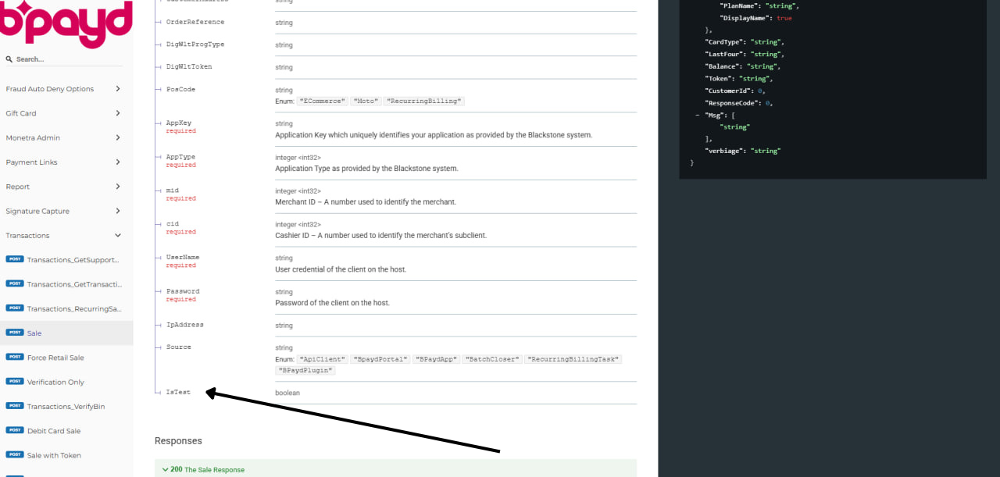
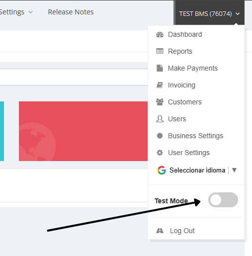

# Sandbox Guide

The sandbox provides merchants with an environment to perform tests. It consists of two fundamental parts: the API and the Portal.

## API Testing

From the API, you can perform transactions using the same credentials as live transactions, but you must mark them as `IsTest` true in the request. For more details on API requests, refer to the [API Documentation](https://documentation.bmspay.com/index.html).

### Transaction Types

The following transaction types are currently supported for testing in the sandbox:

| Transaction Type | Status |
|------------------|--------|
| Sale             | Ready  |
| Force Sale       | Ready  |
| PreAuth          | Coming Soon |
| Complete         | Coming Soon |
| Refund           | To Be Implemented |
| Void             | To Be Implemented |

## Portal Testing

Transactions created via the API in test mode can be viewed on the Payments page in the Portal, and Dashboard statistics will reflect these transactions, provided that "Test Mode" is activated.

By default, transactions and Dashboard statistics display real production data. However, if "Test Mode" is activated, the system switches to displaying information from test transactions.

It is important to note that transactions can also be performed directly from the Portal. The behavior remains consistent: if "Test Mode" is active, these are treated as test transactions; otherwise, they are real transactions.
