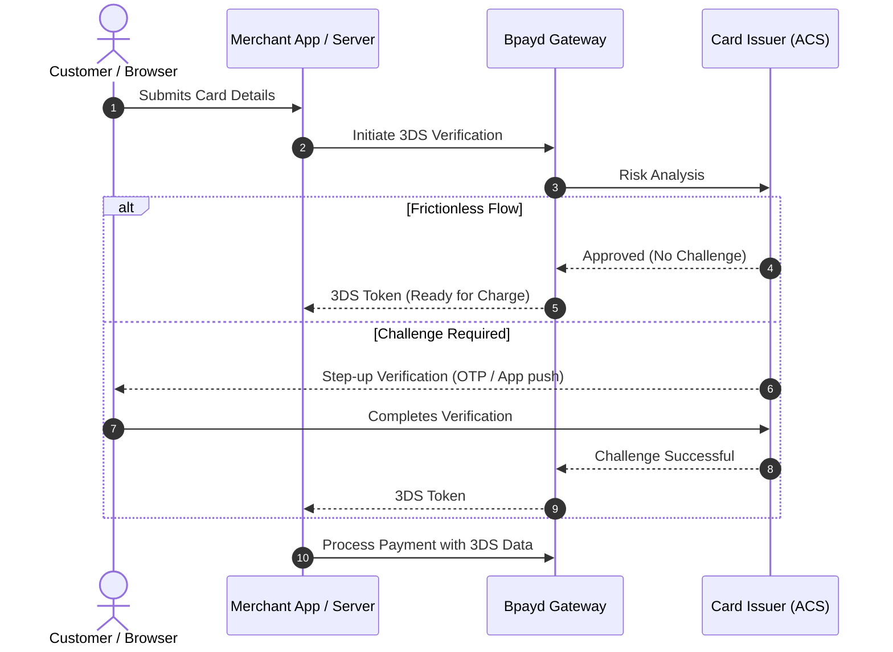

# Security & Authentication

Protect your business and your customers with industry-standard 3D Secure 2.0 authentication and tokenized payment operations.

---

## 3D Secure 2.0 (EMV 3DS)

3D Secure is an authentication protocol that adds an extra layer of protection against fraudulent card-not-present (CNP) transactions, helping you qualify for **liability shift** and comply with international regulations (such as SCA in Europe).

---

## Integration Guides

-   :material-web:{ .lg .middle } __3D Secure for Web__

    ---

    Implement 3DS 2.0 in JavaScript/HTML web checkouts with iframe challenges and callback handling.

    [:octicons-arrow-right-24: Web 3DS Guide](3d-secure-web.md)

-   :material-cellphone-lock:{ .lg .middle } __3D Secure for Mobile__

    ---

    Integrate native and hybrid mobile 3DS workflows for iOS and Android applications.

    [:octicons-arrow-right-24: Mobile 3DS Guide](3d-secure-mobile.md)

