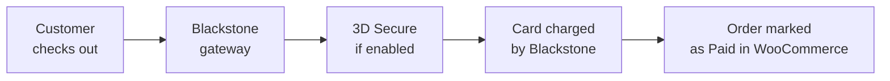

# WooCommerce Plugin

Accept credit and debit card payments on your **WooCommerce** store through Blackstone. The **Blackstone Online Gateway** plugin adds a fully integrated payment method to your checkout, handles 3D Secure authentication, supports surcharges and dual pricing, and lets you refund transactions directly from the WooCommerce order screen — no external portal required.

!!! info "How card data is handled"
    Card details are processed by Blackstone and never stored on your WordPress site. The gateway is stateless, card numbers are tokenized, and your merchant credentials stay in your WooCommerce settings. Blackstone carries the PCI-DSS compliance for card data.

## How it works

1. The customer selects **Credit Card** at checkout and enters their card details.
2. If 3D Secure is enabled, the customer is prompted to authenticate with their bank.
3. Blackstone charges the card and returns an authorization.
4. WooCommerce moves the order to **Processing** (or **Completed** for virtual orders) and stores the transaction reference on the order.

## Before you begin

| Requirement | Detail |
|-------------|--------|
| WordPress | 6.0 or newer |
| WooCommerce | 8.0 or newer — HPOS (High-Performance Order Storage) is fully supported |
| PHP | 8.1 or newer |
| HTTPS | Required in production — 3D Secure and card data submission will not work over plain HTTP |
| Blackstone credentials | API Username, API Password, Merchant ID (MID), Client ID (CID), App Type, App Key |

!!! tip "Don't have your Blackstone credentials?"
    Contact Blackstone Merchant Services at <mailto:support@blackstonemerchant.com> or **305-718-6470** to get your merchant credentials and a sandbox (test) account.

## Install the plugin

### 1. Download the latest version

Download the plugin ZIP from the [latest release](/integration-guides/downloads/woocommerce-plugin/blackstone-online-gateway-latest.zip). You can also pick a specific version from the [version history](#version-history) at the bottom of this page.

### 2. Upload it to WordPress

In your WordPress admin, go to **Plugins → Add New → Upload Plugin**, choose the ZIP file, and click **Install Now**. When the upload finishes, click **Activate Plugin**.

!!! note "Updating from an older version"
    Deactivating and replacing the plugin folder is safe — your settings and existing orders are preserved. We recommend keeping a backup of the previous ZIP before overwriting, so you can roll back if needed.

## Configure your credentials

Credentials are entered **once by an administrator** and stored in your WooCommerce settings.

### 1. Open the gateway settings

Go to **WooCommerce → Settings → Payments** and click **Manage** next to **Blackstone Payment Gateway** (or click the payment method name).

### 2. Enable the gateway and set the display

At the top of the settings screen:

- Tick **Enable Blackstone payment gateway**.
- **Title** — the name customers see at checkout (default: *Credit Card*).
- **Description** — the short text shown under the title at checkout (default: *Pay securely with your credit or debit card.*).

### 3. Enter your API credentials

Under **API Credentials**, fill in:

| Field | What to enter |
|-------|---------------|
| **API Username** | Your Blackstone API username |
| **API Password** | Your Blackstone API password |
| **Merchant ID (MID)** | Your unique Merchant ID (e.g. `76074`) |
| **Client ID (CID)** | Your Cashier / Client ID (e.g. `260`) |
| **App Type** | Application type identifier provided by Blackstone (usually `1`) |
| **App Key** | Your application key for secure API communication |

### 4. Choose the environment

Under **Environment → Gateway Environment**, pick one:

- **Sandbox (Test Transactions)** — no real charges are made. Use this while you're setting things up and testing the flow.
- **Production (Live Transactions)** — real cards, real money. Only switch to this once you've completed a successful sandbox test.

Click **Save changes** at the bottom of the screen.

!!! warning "Sandbox vs Production credentials"
    The same credential fields are used for both environments — Blackstone routes the request based on this toggle. If you were given a separate set of sandbox credentials, swap them in when switching environments.

## Optional features

### 3D Secure

Under **3D Secure**, tick **Require 3D Secure authentication** to enable 3DS. When active, cardholders are asked to confirm the transaction with their bank (usually via a code sent to their phone or through their banking app) before the payment goes through.

3D Secure uses the same environment as the gateway — sandbox 3DS with the sandbox gateway, production 3DS with production.

!!! tip "Force 3DS in Sandbox"
    If your merchant account doesn't have 3DS enabled in Blackstone but you want to test the flow, tick **Force 3DS (Sandbox only)**. This option is ignored when the gateway is in Production.

### Surcharges and dual pricing

Under **Fee Labels**, you can customize how card-related fees appear to customers:

- **Surcharge Label** — the label for an extra fee added when paying by card (default: *Card Processing Fee*).
- **Cash Discount Label** — the label for the price difference between card and cash pricing (default: *Card Price Difference*).

The percentages themselves are configured on your Blackstone merchant account, not in WooCommerce. The plugin reads them from Blackstone and applies them automatically at checkout.

### Debug logging

Under **Debugging**, tick **Enable debug logging** while troubleshooting. Logs are written to **WooCommerce → Status → Logs** and include API requests, responses, and 3DS trace data. Turn it off in normal production use to keep logs clean.

## Take a payment

### 1. Customer checks out

The customer adds items to the cart, goes to **Checkout**, selects **Credit Card** (or whatever you set as the title), and enters their card details.

### 2. 3D Secure verification (if enabled)

If 3D Secure is on, a modal opens and the customer authenticates with their bank. On success, the modal closes and the order continues; on failure, the customer sees a message and can retry with a different card.

### 3. Order is created and paid

Once Blackstone authorizes the charge, WooCommerce creates the order and moves it to **Processing** (or **Completed** for orders with only virtual/downloadable products). An order note records the Blackstone service reference number for later lookup.

### Pay-for-order links

You can also charge an existing order by sending the customer a **pay-for-order** link. From the order edit screen, click **Customer payment page** to copy the URL. The customer opens the link, enters their card, and pays — the same 3DS and surcharge rules apply.

!!! note "Changing the order total after creating the link"
    If you edit the order items before the customer pays, the plugin automatically recalculates the total on the pay page and again just before charging, so the customer is never charged a stale amount. Every automatic recalculation is recorded as an order note.

## Refunds

You can issue full or partial refunds directly from the order edit screen without leaving WordPress.

### 1. Open the order

Go to **WooCommerce → Orders** and open the order you want to refund.

### 2. Refund via Blackstone

Scroll to the **Order actions** area. Below the standard WooCommerce refund controls, you'll see a **Refund via Blackstone** button (or a similar labeled control) for each refundable line. Enter the amount and confirm.

The plugin sends the refund to Blackstone using the stored transaction reference, updates the order status to **Refunded** (full) or keeps it in its current status with the refunded amount deducted (partial), and adds an order note with the refund details.

!!! warning "Refunds must go through Blackstone"
    Do not use only the standard WooCommerce "Refund" button (the one that doesn't say *via Blackstone*) — that only records the refund in WooCommerce without contacting Blackstone, and the money will not be returned to the cardholder.

## Going live

Before switching to production:

- [x] Complete at least one successful test transaction in **Sandbox** mode.
- [x] Verify the customer receives the correct order confirmation email.
- [x] Test at least one refund from the WooCommerce order screen.
- [x] Confirm your site is served over **HTTPS**.
- [x] If 3D Secure is required by your merchant account, test the challenge flow at least once.

When you're ready, go to **WooCommerce → Settings → Payments → Blackstone Payment Gateway**, switch **Gateway Environment** to **Production (Live Transactions)**, save, and place a small real charge to confirm everything is wired correctly.

## Troubleshooting

| Issue | Cause and fix |
|-------|---------------|
| **Refund via Blackstone button doesn't appear on the order screen** | Fixed in **4.7.7**. Under HPOS without compatibility sync, the plugin didn't recognize the order edit URL. Update to 4.7.7 or newer. |
| **Customer is charged a different amount than the order total on a pay-for-order page** | Fixed in **4.7.6**. If you edit items on a pending order, the persisted total can lag behind. 4.7.6 and newer recalculate automatically before rendering the pay page and before charging. |
| **3D Secure doesn't trigger on the pay-for-order page** on a site with translated WooCommerce URLs | Fixed in **4.7.5**. Earlier versions relied on the English `order-pay` URL slug; 4.7.5+ detects the page by the `pay_for_order=true` query parameter. |
| **Payment fails with "INVALID CARD DIFFERENCE AMOUNT" after changing merchant settings** | Fixed in **4.7.3**. Stale session values can persist; update to 4.7.3 or newer and ask the customer to reload the checkout. |
| **Place Order button stays disabled after a failed 3DS attempt** | Fixed in **4.7.3**. Update to 4.7.3 or newer. |
| **Fatal error on PHP 8.1+ about uninitialized typed properties** | Fixed in **4.7.1**. Update to 4.7.1 or newer. |
| **API errors, unclear checkout behavior, or need to send logs to support** | Enable **Debug Log** under the gateway settings, reproduce the issue, and export the log from **WooCommerce → Status → Logs**. Send the log file to <mailto:support@blackstonemerchant.com>. |

For anything not listed here, contact <mailto:support@blackstonemerchant.com> with your merchant ID, the plugin version, and a debug log covering the failing transaction.

## Version history

### Download latest

[Download Latest](/integration-guides/downloads/woocommerce-plugin/blackstone-online-gateway-latest.zip)

### All versions

| Version | Date       | Download                                                                              | Notes                                                                                                                                                                            |
|---------|------------|---------------------------------------------------------------------------------------|----------------------------------------------------------------------------------------------------------------------------------------------------------------------------------|
| 4.7.7 | 2026-05-06 | [ZIP](/integration-guides/downloads/woocommerce-plugin/blackstone-online-gateway-4.7.7.zip) | Fixed Blackstone Refund buttons not appearing on the order edit screen under High-Performance Order Storage (HPOS). The detector relied on `get_post_type() === 'shop_order'`, which returns `'shop_order_placehold'` when HPOS is active without compatibility sync, so the refund JavaScript was never enqueued. The detector now accepts the placeholder type and falls back to `wc_get_order()` for storage-agnostic resolution, covering Legacy, HPOS+sync, and HPOS-only configurations. |
| 4.7.6 | 2026-05-05 | [ZIP](/integration-guides/downloads/woocommerce-plugin/blackstone-online-gateway-4.7.6.zip) | Fixed pay-for-order pages charging the original order amount instead of the current items total when the admin modified items without clicking "Recalculate" — the persisted order total is now refreshed automatically before rendering the customer pay page and again defensively before charging the API. An order note records every recalculation for auditing. Skipped on orders carrying surcharge/card-difference fee metadata to preserve the existing fee flow. |
| 4.7.5 | 2026-05-04 | [ZIP](/integration-guides/downloads/woocommerce-plugin/blackstone-online-gateway-4.7.5.zip) | Fixed 3DS verification not triggering on the pay-for-order page on sites with translated WooCommerce slugs — detection now uses the pay_for_order=true query parameter instead of the English-only order-pay URL slug. |
| 4.7.4 | 2026-05-03 | [ZIP](/integration-guides/downloads/woocommerce-plugin/blackstone-online-gateway-4.7.4.zip) | Added client-side UUID generation for clientTransactionId using crypto.randomUUID() with Math.random() fallback; each checkout attempt generates a unique identifier. Added automatic JWT refresh on 401 errors from the 3DS SDK — refreshes server-side token and retries verify() once with a new clientTransactionId. Added "Force 3DS (Sandbox only)" admin toggle to bypass the merchant API flag during sandbox testing; automatically selects sandbox endpoint when active. Added billing address, email, city, state, and ISO 3166-1 numeric country code to 3DS form data fields. Added ISO 4217 numeric currency code conversion with MXN support. Fixed 3DS challenge iframe sizing — scoped CSS injected in document.head prevents SDK from overriding iframe dimensions; modal width set to 460px, iframe fixed at 390x400. Fixed <style> tag accumulation across multiple failed 3DS attempts — cleanup now removes injected style nodes from the DOM. Fixed silent error callback — unknown 3DS errors now show a user-facing message instead of resetting the form with no feedback. Fixed 401 detection false positives — regex now matches word-boundary \b401\b instead of substring, preventing matches on amounts or error codes containing "401". Fixed force_3ds_sandbox endpoint selection — sandbox endpoint is now correctly used when the flag is active regardless of gateway environment setting. Added rate limiting to the 3DS token refresh AJAX endpoint (1 request per 60 seconds per session) to prevent API abuse. Switched 3DS SDK to stable version 2.2.20231219. |
| 4.7.3 | 2026-04-26 | [ZIP](/integration-guides/downloads/woocommerce-plugin/blackstone-online-gateway-4.7.3.zip) | Fixed 3DS retry leaving the Place Order button permanently disabled when the error callback received a falsy value. Fixed stale session surcharge and card difference values causing INVALID CARD DIFFERENCE AMOUNT rejections after merchant settings change. Fixed JS-to-server AJAX log handler bypassing the debug-mode gate for debug and info level messages. Switched logger from prepend to append mode, eliminating crash data-loss risk and O(n) I/O per write. Capped incoming JS log messages at 500 characters. Cached 3DS token with a 5-minute transient to prevent blocking HTTP calls on every checkout update. Fixed stale #billing-form causing 3DS retries to use previous card data. Fixed "No result found" polling message incorrectly destroying the 3DS session mid-poll. Updated 3DS library from 2.2.20231219 to 2.2.20250411. Fixed _bmspay_original_amount to store the full charged amount including surcharge and card difference. Added server-side JS logging via AJAX for full 3DS trace in WC logs. |
| 4.7.2 | 2026-04-23 | [ZIP](/integration-guides/downloads/woocommerce-plugin/blackstone-online-gateway-4.7.2.zip) | Fixed cart total not including fee at checkout — switched from get_total('raw') to get_subtotal() inside woocommerce_calculated_total filter. Fixed incorrect CardDifferenceAmount sent to Blackstone API — order base now subtracts stored fee meta to avoid circular calculation. Fixed order total double-counting fee on Order Received page — removed redundant set_total() call in save_order_meta. Fixed empty surcharge row in admin order view — each fee row is now conditionally rendered. Fixed fee row alignment in admin — corrected to WooCommerce's three-column structure (label \| spacer \| total). Fixed HPOS compatibility — replaced get/update_post_meta with order object API throughout refund flow. Fixed partial refund buttons remaining disabled after cancelling confirm dialog. Fixed full refund tax calculation to subtract already-refunded tax from prior partial refunds. Fixed missing return statements after wp_send_json_error() calls in refund handler. Fixed SweetAlert2 SRI hashes — pinned to exact version 11.26.24. Removed unused dead code: post_form, get_3ds_credentials, is_3ds_mode. |
| 4.7.1 | 2026-04-21 | [ZIP](/integration-guides/downloads/woocommerce-plugin/blackstone-online-gateway-4.7.1.zip) | Fixed PHP 8.1+ typed properties initialization to prevent fatal errors when accessing properties before initialization. Added default values to all typed properties in the gateway, API client, and credential manager classes. Fixed surcharge and card difference percentage display in checkout. Improved charge breakdown calculation to include percentage values. |
| 4.7.0 | 2026-04-20 | [ZIP](/integration-guides/downloads/woocommerce-plugin/blackstone-online-gateway-4.7.0.zip) | Synchronized plugin version metadata for the 4.7.0 release. |
| 4.6.6 | 2026-04-09 | [ZIP](/integration-guides/downloads/woocommerce-plugin/blackstone-online-gateway-4.6.6.zip) | Completed Spanish translations for all active plugin strings and regenerated the compiled language pack. |
| 4.6.5 | 2026-04-09 | [ZIP](/integration-guides/downloads/woocommerce-plugin/blackstone-online-gateway-4.6.5.zip) | Restored active Spanish translations and regenerated localization catalogs without obsolete entries. Fixed final refund bookkeeping so orders move to refunded when the remaining refundable balance reaches zero after prior partial refunds. Removed the unused refund card form, template, and input mask asset from the plugin package. |
| 4.6.4 | 2026-04-09 | [ZIP](/integration-guides/downloads/woocommerce-plugin/blackstone-online-gateway-4.6.4.zip) | Hardened the Blackstone refund flow with stricter server-side validation, immutable sale references, and refund-specific tracking metadata. Prevented refund modal hangs by improving AJAX error handling and aligning the custom refund action across PHP and JavaScript. Removed sensitive payment logging and restored standard TLS verification for payment requests. Limited the checkout input mask script to the intended checkout context. Regenerated translation catalogs and synchronized plugin metadata to the current release. |
| 4.6.3 | 2026-04-08 | [ZIP](/integration-guides/downloads/woocommerce-plugin/blackstone-online-gateway-4.6.3.zip) | Fixed wallet partial payments so gateway charges, 3DS amounts, and surcharge calculations use the net WooCommerce total including negative wallet fees. Removed the custom checkout refresh flow that cleared cart fees and now rely on WooCommerce recalculation to preserve wallet discounts. |
| 4.6.2 | 2026-04-08 | [ZIP](/integration-guides/downloads/woocommerce-plugin/blackstone-online-gateway-4.6.2.zip) | Fixed 3DS Integrator CDN URL to use the minified version. |
| 4.6.1 | 2026-03-23 | [ZIP](/integration-guides/downloads/woocommerce-plugin/blackstone-online-gateway-4.6.1.zip) | Added automated ZIP packaging, artifact publishing, and GitHub release publication for the plugin. Added automated integration-guides updates for the latest ZIP alias and WooCommerce plugin versions table. |
| 4.5.56  | 2026-02-19 | [ZIP](/integration-guides/downloads/woocommerce-plugin/blackstone-online-gateway-4.5.56.zip) | Fixed token payment validation and prevented invalid 3DS response errors on saved-card transactions.                                                                            |
| 4.5.50  | 2026-01-22 | [ZIP](/integration-guides/downloads/woocommerce-plugin/blackstone-online-gateway-4.5.50.zip) | Bug fixes and general improvements.                                                                                                                                              |
| 4.5.48  | 2025-12-10 | [ZIP](/integration-guides/downloads/woocommerce-plugin/blackstone-online-gateway-4.5.48.zip) | Bug fixes and general improvements.                                                                                                                                              |
| 4.5.43  | 2025-11-05 | [ZIP](/integration-guides/downloads/woocommerce-plugin/blackstone-online-gateway-4.5.43.zip) | Plugin Compatibility Fix and Refund Data in Order Notes.                                                                                                                         |
| 4.5.41  | 2025-10-22 | [ZIP](/integration-guides/downloads/woocommerce-plugin/blackstone-online-gateway-4.5.41.zip) | Validate ZipCode.                                                                                                                                                                |
| 4.5.40  | 2025-10-14 | [ZIP](/integration-guides/downloads/woocommerce-plugin/blackstone-online-gateway-4.5.40.zip) | Center larger 3DS iframe; fix pay button enablement for retry without refresh; show failed 3DS messages in a modal; add billingPostCode and cardHolderName to 3DS verification.  |
| 4.5.36  | 2025-10-02 | [ZIP](/integration-guides/downloads/woocommerce-plugin/blackstone-online-gateway-4.5.36.zip) | Internal changes.                                                                                                                                                                |
| 4.5.35  | 2025-10-01 | [ZIP](/integration-guides/downloads/woocommerce-plugin/blackstone-online-gateway-4.5.35.zip) | Adjustments to the failed 3DS verification message.                                                                                                                              |
| 4.5.34  | 2025-09-30 | [ZIP](/integration-guides/downloads/woocommerce-plugin/blackstone-online-gateway-4.5.34.zip) | Adds `SecureTransactionId` capture & submission. See [3DS Guide](/integration-guides/three-domain-secure#step-4-include-securedata-and-securetransactionid-in-payment-requests). |
| 4.5.32  | 2025-08-31 | [ZIP](/integration-guides/downloads/woocommerce-plugin/blackstone-online-gateway-4.5.32.zip) | Adds Sandbox mode support. Refer to [Sandbox Mode Documentation](/integration-guides/sandbox) for details.                                                                       |
| 4.5.31  | 2025-07-02 | [ZIP](/integration-guides/downloads/woocommerce-plugin/blackstone-online-gateway-4.5.31.zip) | Include ACV and CVV verification responses in order notes.                                                                                                                       |
