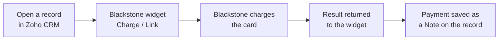
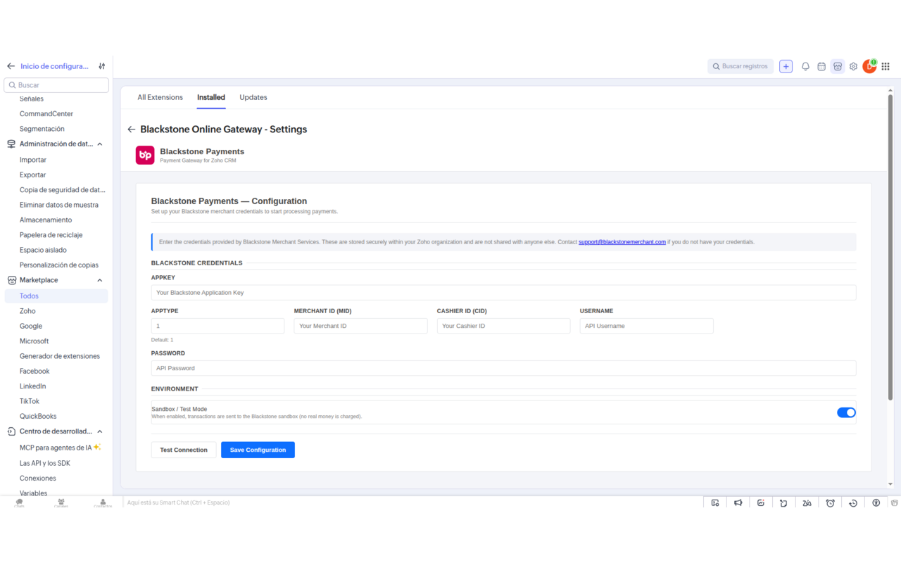
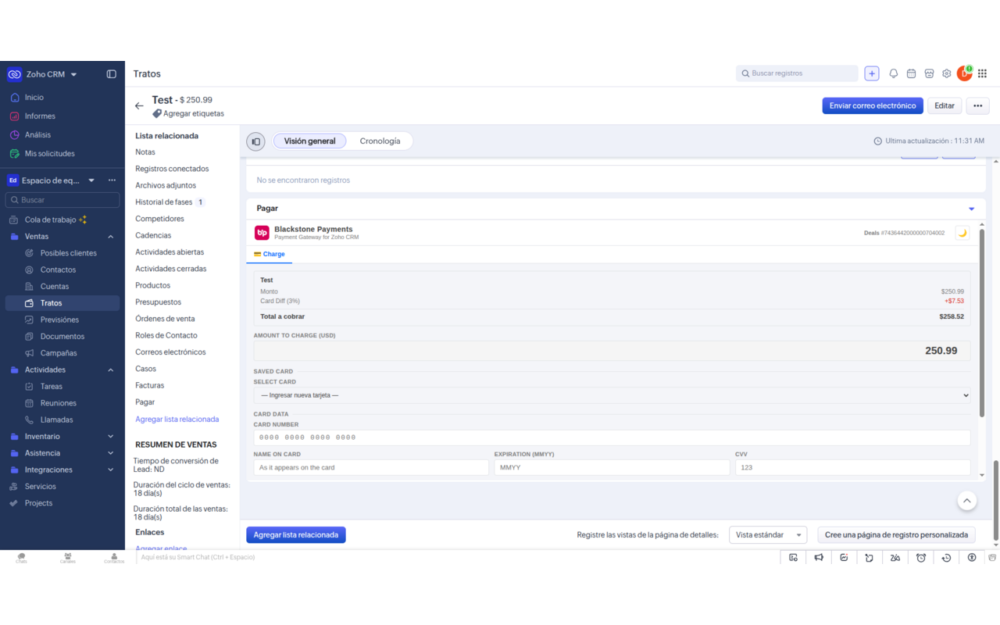
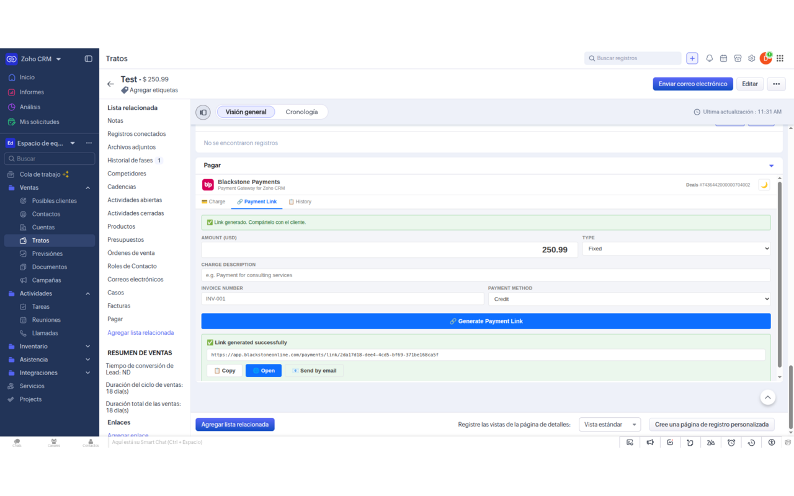
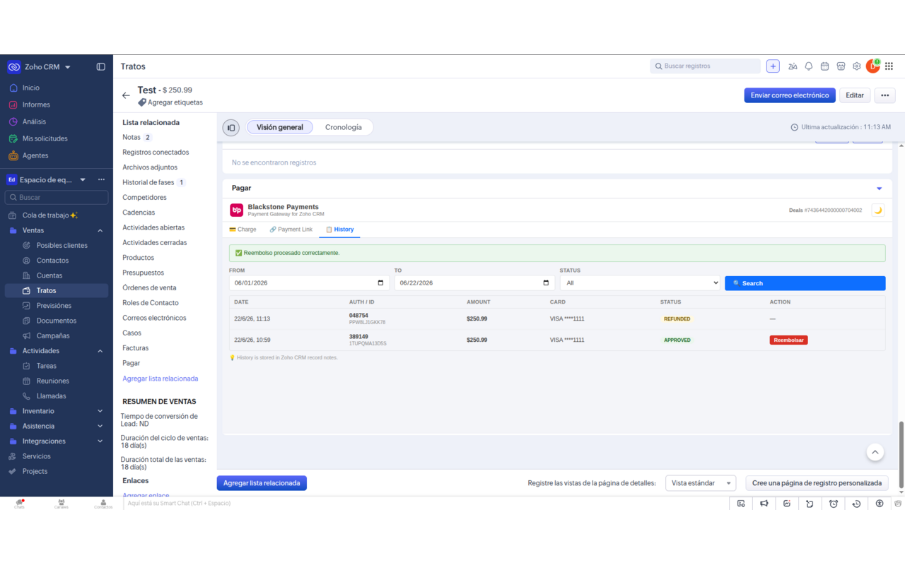

# Zoho CRM Integration

Accept credit card payments directly inside **Zoho CRM** through Blackstone. The **Blackstone Online Gateway** extension adds a payment panel to your Deals, Contacts, and Invoices, so your team can charge a card, send a payment link, and issue refunds without ever leaving a record — and every transaction is saved back to the record automatically.

!!! info "How card data is handled"
    Card details are processed by Blackstone and never stored by the integration. The backend is stateless, card numbers are tokenized, and merchant credentials stay inside your own Zoho organisation. Blackstone carries the PCI-DSS compliance for card data.

## How it works

1. You open a Deal, Contact, or Invoice and the Blackstone Payments widget appears.
2. You charge a card, or generate a payment link for the customer.
3. Blackstone charges the card and returns an authorization.
4. The payment is recorded as a **Note** on the record, building a per-record history.

## Before you begin

| Requirement | Detail |
|-------------|--------|
| Zoho CRM edition | **Professional or higher** — the extension works with the Invoices module, which is not available on Free/Standard editions |
| Blackstone credentials | AppKey, AppType, Merchant ID (MID), Cashier ID (CID), Username, Password |
| CRM access | Administrator access to install the extension and enter credentials |

!!! tip "Don't have your Blackstone credentials?"
    Contact Blackstone Merchant Services at <mailto:support@blackstonemerchant.com> or **305-718-6470** to get your merchant credentials and a sandbox (test) account.

## Install from the Zoho Marketplace

### 1. Find the extension

Search for **Blackstone Online Gateway** in the [Zoho Marketplace](https://marketplace.zoho.com/) and click **Install**. Choose whether to install for all users or for specific profiles and roles.

### 2. Grant permissions

The extension needs to read Deals, Contacts, and Invoices, and to create and read Notes — this lets it pre-fill amounts and save your payment history. After installing, the payment widget appears automatically in the right-hand panel of the supported records.

## Configure your credentials

Credentials are entered **once by an administrator** and stored securely inside your Zoho organisation. Regular users never see or type them.

### 1. Open the settings

Go to **Setup → Marketplace → Installed Extensions → Blackstone Online Gateway → Settings**.

### 2. Enter your details and test

Fill in AppKey, AppType (default `1`), Merchant ID (MID), Cashier ID (CID), Username, and Password. Tick **Sandbox / Test Mode** while testing, click **Test Connection** to verify, then **Save Configuration**.

!!! note "Your credentials are protected"
    Credentials are stored inside your own Zoho organisation and are never persisted by the Blackstone backend, which is fully stateless.

## Where the widget appears

The Blackstone Payments panel shows up on the right-hand side of these records and fills in details for you automatically:

| Module | What is pre-filled |
|--------|--------------------|
| **Deals** | Amount from the Deal amount; reference from the Deal name |
| **Contacts** | No amount pre-fill — you enter the amount to charge |
| **Invoices** | Amount from the invoice total; invoice number for payment links |

The widget has up to four tabs: **Charge**, **Payment Link**, **History**, and (for admins) **Config**.

## Charge a card

### 1. Open a record and check the amount

Open any Deal, Contact, or Invoice. On the **Charge** tab the amount is pre-loaded from the record — adjust it if needed.

### 2. Enter the card and charge

Type the card number, expiration, CVV, and name on card. Optionally add the billing address and tax, then click **Charge Now**. Approved payments show an authorization number and reference; declined payments show the reason.

!!! tip "Sandbox test card"
    In test mode, use card `4111 1111 1111 1111`, expiry `08/30`, CVV `123`, ZIP `32606`. No real money moves in sandbox.

!!! note "Automatic record-keeping"
    When a payment is approved, a Note is added to the record automatically — for example `Blackstone | $100.00 | APPROVED | VISA ****1111`. You'll find it in the History tab.

## Send a payment link

Use a payment link when you want the customer to pay themselves on a secure Blackstone page — no card details are entered in the CRM.

### 1. Generate the link

Open the **Payment Link** tab, enter the amount and description, and choose **Fixed** (a set amount) or **Open** (the customer chooses). Click **Generate Payment Link**.

### 2. Share it

Copy the link and send it to your customer by email or message. They complete payment on Blackstone's secure hosted page, including any 3-D Secure step, which is handled automatically.

## Review the payment history

The **History** tab shows every payment made on that specific record. Open the tab and click **Search** to see each transaction with its date, authorization/reference, amount, card, and status.

!!! note "History is per record"
    Each Deal, Contact, or Invoice keeps its own payment history, stored as Notes on that record — so it stays with the customer it belongs to.

| Status | Meaning |
|--------|---------|
| `APPROVED` | Payment approved — a Refund button is available |
| `REFUNDED` | The payment was refunded |
| `VOIDED` | The payment was cancelled the same day |
| `LINK` | A payment link was generated (payment still pending) |

## Refunds

Full and partial refunds are supported. In the **History** tab, click **Refund** on an approved row and confirm. On success the row status changes to **REFUNDED** and the record's Note is updated automatically.

!!! note "Refund vs. void"
    A payment can only be voided the same day, before Blackstone closes its daily batch. After that, use a refund. A payment can't be refunded twice or for more than its remaining balance.

## 3-D Secure &amp; saved cards

3-D Secure adds a bank verification step (such as an SMS code or a banking-app approval) before a payment goes through, reducing fraud and chargebacks. If your Blackstone account has it enabled, the customer may see a quick challenge during checkout — on payment links this is fully automatic.

For repeat customers you can securely save a card for future payments. The full card number is never stored; only a secure token that represents the card is kept, so next time you can pick the saved card and charge with one click.

!!! tip "Enabling 3-D Secure"
    3-D Secure is a setting on your Blackstone account. To turn it on, contact Blackstone at <mailto:support@blackstonemerchant.com>.

## Going live

!!! warning "Real money moves in production"
    In **Setup → Blackstone Online Gateway → Settings**, untick **Sandbox / Test Mode** and enter your **production** Blackstone credentials. Run a small real payment to confirm everything works before charging customers.

## Troubleshooting

| Issue | Fix |
|-------|-----|
| `Invalid credentials` when charging | Re-check each field in Settings and click **Test Connection**. If it still fails, verify the credentials with Blackstone. |
| Payment declined (`Insufficient Funds`) | The customer's bank declined the charge — not a plugin error. Try another card or ask the customer to contact their bank. |
| Approved but no Note on the record | The CRM profile may lack permission to create Notes. Check **Setup → Security → Profiles**. |
| Amount not pre-filled | The record may use a custom field name in your org. Contact Blackstone support to map it. |
| Payment link customer can't pay | The link may already be paid (one-time use), or was created in sandbox (test cards only). Generate a new link in production. |
| Widget doesn't appear | Reinstall the extension from the Marketplace and confirm it's enabled for your profile. Disable browser content blockers. |
